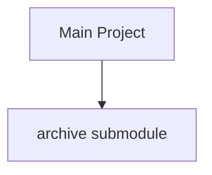

# 手动部署流程

如果您不想使用 Agent 引导部署，可以参考本手册手动搭建整个链路。

## 1. 消息桥接部署

1. **Docker 安装**: 确保系统已安装 Docker。
2. **部署 NapCat**: 运行 NapCat 容器并登录 QQ。
3. **部署 EDU-PUBLISH**: 运行 EDU-PUBLISH 容器，安装 `edu-publish-QQtoLocal` 插件。
4. **配置挂载**: 将项目的 `archive/` 目录挂载到 EDU-PUBLISH 容器中。

## 2. Archive Submodule 初始化

`archive/` 目录是一个独立的 Git submodule，需要手动初始化。



```bash
git submodule init
git submodule update
```

## 3. Agent 内容生产部署

1. **Agent 环境**: 确保本地有 Agent (如 ClaudeCode) 或 AI API 环境。
2. **配置规则**: 检查 `BOT_RULES.md` 中的生产规则。
3. **运行 Agent**: 让 Agent 读取 `archive/` 并生成 `content/card/`。

## 4. 站点构建与发布

1. **依赖安装**: `pnpm install`。
2. **构建站点**: `pnpm run build`。
3. **手动发布**: 将 `dist/` 目录的内容手动上传到您的静态服务器。

::: tip
手动部署更具灵活性，但建议先通过 Agent 引导部署熟悉整体流程。
:::
