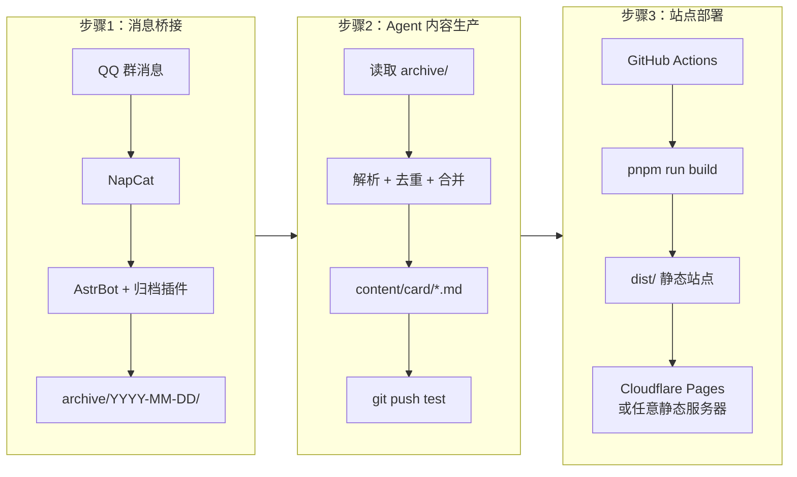

# 整体架构

EDU-PUBLISH 采用三段式独立架构，各模块相互解耦，可以根据需求灵活选择运行。

## 架构流程图

## 各阶段职责

- **消息桥接**: 负责将 QQ 协议的消息落盘为本地文件。
- **Agent 生产**: 读取本地归档，利用 AI 自动生成结构化的 Markdown 卡片。
- **站点部署**: 自动将生成的 Markdown 内容构建并发布为静态站点。
